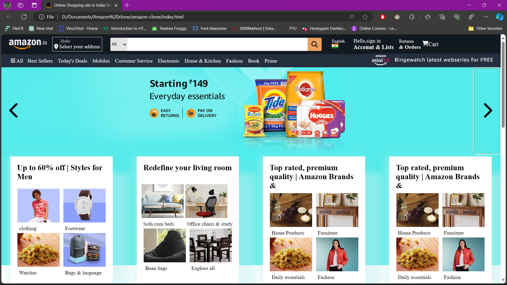

# Amazon_Clone_Visham_Sangral

**Amazon Clone by Visham Sangral**

**Overview**
My commitment to the web development course and my acquired knowledge resulted in this Amazon Clone project. As a growing developer, I set out to replicate the key features of the Amazon website in order to demonstrate my skills with full stack web development.

**Features**
User authentication: Users can create accounts, log in, and log out using a secure user authentication system.
Product Listings: Detailed presentation of products complete with pictures, details, and costs.
Shopping Cart: Customers can view their cart, add items to it, and check out.
Real-time Updates: Incorporating current information about product availability and costs.
Payment Integration: Using safe payment gateways, payments are processed quickly and easily.
Order History: A history of the user's orders kept for future use.
Ensures a fluid and aesthetically pleasing experience on a range of devices with responsive design.

**Technologies Used**
Frontend: HTML, CSS, React.js
Backend: Node.js, Express.js
Database: MongoDB
Authentication: Firebase Authentication
Payment Processing: Stripe API

**Installation**
Clone the repository: git clone ( https://github.com/Visham111/amazon-clone )
Navigate to the project folder: cd amazon-clone
Install dependencies: npm install
Run the application: npm start

**How to Use**
Create an account or log in.
Explore products and add them to your cart.
Proceed to checkout and complete the payment.
View your order history.

Feel free to contribute to the project or report any issues. Happy shopping!

